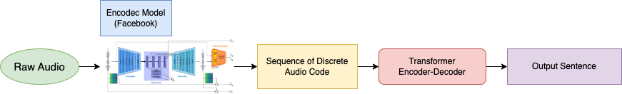
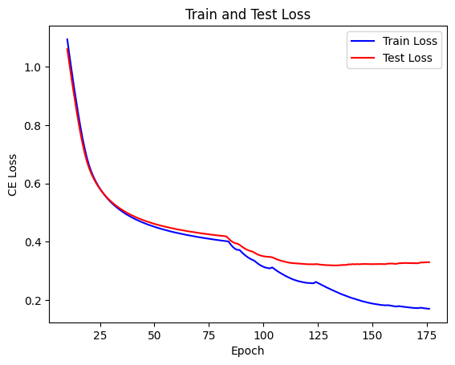

# Music-Description-Generator

## Model Architecture



## Training & Test Loss Graph



## Examples

#### Ex 1

https://github.com/ongdyub/Music-Description/assets/88565572/48438cbf-cd37-4156-af54-649c3b008db8

```python
'This is a classical music piece. It could also be playing in the background at a coffee shop.'
```

#### Ex 2

https://github.com/ongdyub/Music-Description/assets/88565572/3da542d2-a078-4620-9b0f-4239f0983c8e

```python
'The low quality recording features a live performance of a folk song and it consists of groovy bass, shimmering hi hats, soft kick and harmonizing vocals, harmonizing vocals. It sounds energetic.'
```
